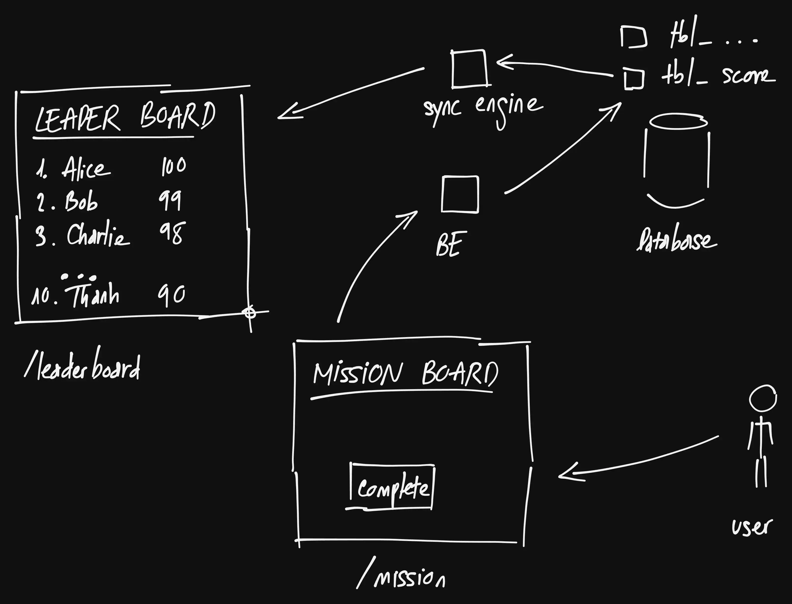

# 99Tech Code Challenge

This is my take on the hiring challenge by 99Tech. I applied for a backend role,
and the problems for the role are:

> - Problem 4: Three ways to sum to n
> - Problem 5: A Crude Server
> - Problem 6: Architecture

Note: I used LLM(s) for proof reading, not for coding nor problem understanding.
Everything is 100% typed by me at first.

## Problem 4

Basically, the problem is to calculate $\sum_{i=1}^{n} i$. For example:

```python
# input
n = 5
# calculation
f(n) = f(5) = 1 + 2 + 3 + 4 + 5 = ?
```

The full code with tests can be found [here](src/problem4/src). I implemented
3 versions as required (albeit I'm not sure if the first and the second version
differ that much).

### Version A: straight forward looping

The code looks like this:

```ts
export function versionA(n: number): number {
  let sum = 0;
  for (let i = 1; i <= n; i++) {
    sum += i;
  }
  return sum;
}
```

- Time complexity is `O(n)`, as we are iterating `n` times.
- Space complexity is `O(1)`, as we are wasting no space.

### Version B: using `reduce`

I implemented a more "functional programming" variation of the above version:

```ts
export function versionB(n: number): number {
  if (n <= 1) {
    return 1;
  }

  const numbers = Array.from(Array(n + 1).keys());
  const sum = numbers.reduce((acc, cur) => acc + cur, 0);
  return sum;
}
```

- Time complexity is `O(n)`, as we are iterating `n` times.
- Space complexity is `O(n)`, as we are creating array `numbers` that has
  `n + 1` elements from `0` to `n`. It can be optimized by using iterator, but I
  don't feel that it's needed.

### Version C: using a well-known mathematics formula

The formula is:

$$
  \sum_{i=1}^{n} i = \frac{n(n + 1)}{2}
$$

It's implementation is the simplest, but I think the challenge is to be aware of
it (and maybe to prove it using induction):

```ts
export function versionC(n: number): number {
  return Math.round((n * (n + 1)) / 2);
}
```

- Time complexity is `O(1)`, as we are "just" doing a simple calculation.
- Space complexity is `O(1)`, as we use next to no memory at all.

## Problem 5

The word play in the description is nice, where "crude" and "CRUD" are
homophones (same sound, different spelling; I actually had to look up the word).
Dependency installation and running can be found at the
[README](src/problem5/README.md). The server is pretty basic, but I'll try to
list out some interesting choices I made:

- `pnpm` instead of `npm`: faster installation; can be used for
  workspace/monorepo later.
- Biome instead of Prettify + ESLint: faster; easier to set up and simpler
  configuration.
- SQLite instead of Postgres/MySQL/MongoDB: easier to setup (Postgres or MySQL
  or MongoDB would require more work on both local development and production
  deployment) and test (I can spin up in-memory SQLite for testing).
- No ORM + hand-rolled migration code: I think in a team environment, I would go
  with Drizzle/Kysely, but it's overkill for this project.

I'll try to justify my codebase's structure as well:

- Database interaction in `namespace DataAccess` with functions receiving a
  `db` parameter.

  ```ts
  // data-access.ts
  import BetterSQLite3 from "better-sqlite3";

  export namespace DataAccess {
    export function createDb(dbUrl: string): BetterSQLite3.Database {
      // ...
    }

    export function migrate(db: BetterSQLite3.Database) {
      // ...
    }

    export namespace TodoItem {
      export function create(
        db: BetterSQLite3.Database,
        item: {
          title: string;
          description: string;
        },
      ) {
        // ...
      }
    }
  ```

  I'd say this structure of just using function with parameters is simpler to
  read and to test. In case we really need a database-agnostic solution (like
  using PostgresQL instead of SQLite), then we can either refactor `db` to a
  more generic interface, or copy the database access code to a `v2` and
  gradually implement new endpoints.

- 2-layers-ish, where a new request would get parsed for parameters (POST
  body, or GET path param), then the parameters would be used by a function in
  `namespace DataAccess`.

  ```ts
  // index.ts
  import express from "express";
  import { DataAccess } from "./data-access.js";

  const app = express();

  const db = DataAccess.createDb(dbUrl);
  DataAccess.migrate(db);

  // ...
  app
    .get("/api/v1/todo-items", (req, res) => {
      const searchKeyword =
        typeof req.query.search === "string" && req.query.search !== ""
          ? req.query.search
          : undefined;
      const completed = req.query.completed === "true";
      try {
        const items = DataAccess.TodoItem.listAll(db, searchKeyword, completed);
        res.status(200).json({
          data: items,
        });
      } catch (err) {
        console.error(err);
        res.status(500).json({
          success: false,
        });
      }
    })
    .post("/api/v1/todo-items", (req, res) => {
      // ...
    });
  ```

  Again, I think this approach helps making the code simple and easy to test.
  However, I totally understand teams' rationales if they decide to go with
  something heavy-weight like NestJS and would follow the established
  convention.

Should I have more time, I would implement these things as well:

- Logging library: it'd be great if we wrap the current `console.log` calls
  around a `logger`
- Data validation using `zod`: it's better than throwing error 500 at every
  error like the current implementation.
- Build to single `.js` using `esbuild` + Dockerfile: for a production-grade
  deployment, people would expect the service to be Dockerized, and we should
  give them that. However, I noticed that the image size would be large if we
  copy also `node_module/`, so I often try to
  - Use `esbuild` to turn the code into a single `index.js` file (similar to how
    we build binary file), then
  - Copy the final file to a "clean" image that only has NodeJS available

## Problem 6

The original requirements stated that we need

- A score board that is live updated, with
- The score increment comes from somewhere else, and
- We should authorize the score increment.

And our task is to write a document/specification and let a backend engineering
team handle it.

While everything is quite straight forward, I think in a real-life setting, I
would clarify more on: what is the required latency?

- Would the user be satisfied with something like 3 or 5 seconds delay comparing
  to the live score?
- Another variation of the question is: how would the user interact with the
  score board? Would they look at it like a live score and expect it to be
  always up to date, or they would just check it daily or hourly for changes?

I ask about that because designing the module for a higher latency module (>1s
is acceptable, or if the user only check the data once a day) would be much more
simpler than a low latency equivalent (>1s is not acceptable). Scalability is
another factor: how many people are looking at the score board? It's obvious
that we would need to take into account much more factor if the score board
serves something like 10k concurrent users.

For now, to keep the design simple, I'd assume that:

- The page is latency sensitive/needs to be updated within 1 second
- We are serving around 100 concurrent users

Apart from clarifying those non-functional requirements, I would pick one of
these options after considering the team's openness to experiment and the
current codebase's state as well:

- Option 1: hand roll something using either SSE, or WebSocket, or just plain
  polling. We should do this if we have a well-established code base already, or
  we are new but the team aren't that open for expirement.
- Option 2: go all-in on a BaaS (Backend as a Service) like Convex, or Supabase,
  or even Pocketbase and Firebase. I think this option might work if we are
  given the chance to do something from scratch, and the team is open for doing
  something new.
- Option 3: this is a variation of Option 1, where we replace we use a "sync
  engine" like PowerSync or ElectricSQL or ZeroSync to abstract away the manual
  work with SSE or WebSocket. Of course, while this is "safer" than Option 2, it
  has its own limitations (namely PowerSync and ElectricSQL only support 1
  table sync and the query cannot be too complex).

For the sake of completeness, I'll add other assumptions:

- The team is open to expirement
- We have an existing backend already

Therefore, Option 1 and Option 3 are potential candidates. I rolled a working
implementation for Option 1 in another [take-home
test](https://github.com/thanhnguyen2187/elsa-challenge), and Option 2 is a bit
too trivial to have further discussion, so I'll write about how I'd implement
Option 3 with this high-level design:



We'd have two pages:

- `/leaderboard`: where we look at people with top scores
- `/mission`: personal pages of each user, where they can "complete" mission to
  increase their score

The mission page would call the backend service, then ask it to interact with a
database as usual. The end result would be in a table named `tbl_scores` and
sync'ed by the sync engine to be displayed on page `/leaderboard`.

For the steps in the implementation plan, I'd ask the team to:

1. Do research and implement a POC that mimics current infrastructure (existing
   backend service and database) with ZeroSync, PowerSync, and Electric SQL as
   they seem to be the most mature and integrate well with existing databases
2. Report on their experience (whether those tools make sense for this problem),
   decide if it's better to use either of them or hand roll the work
3. Do the actual implementation

